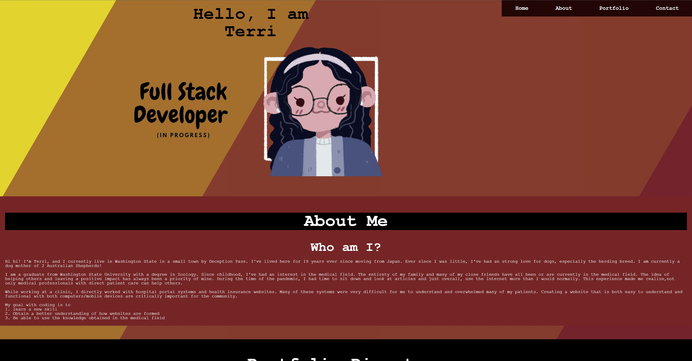

# My Starter Coding Portfolio
## Using HTML and CSS
### Module 2 assignment- to create a html website from scratch using advanced css techniques.
### The criteria the portfolio needed to meet are: 
### 1. The name of developer (myself), a photo or avatar, and a navigation bar to link to each designated section must be included.
### 2. Have the navigation bar be functional with a UI scroll.
### 3. The portfolio directory has functioning links with each listed project. 
### 4. The webpage works on various screens and devices.

 

### This portfolio will be used as a "basecamp" for all future projects completed while I continue through the UW coding bootcamp course. With time, the project directory will include more links to each new project or group projects done during the course. As I learn more coding skills such as javascript, I plan to include a "skills" section to allow viewers to know each coding skill that is in my kit. 

 

# Webpage Image with working link
<!-- webpage link with image -->
### Link https://terrinmack.github.io/Starter-Portfolio/

 

# Installation 
* Created a wireframe of the general portfolio page. 
    * Side note/fun fact: I personally watched many youtube videos and read many articles. I changed my wireframe up to 5 times. My webpage code likely is still not optimized 😭
* Created a new repository on github with an html index, style.css, and reset.css.
* Through trial and error, created a general, non-stylized html page with a navigation bar at the top of the page, home section, about me, project directory, and contact me sections. 
* Used advanced CSS techniques learned via the UW coding bootcamp and google searches to create a more aesthetcially functional webpage. 
* Ensured that the webpage functions with multiple media queries. 

 

# Credits
### Animated background CSS code provided by [Slider Revolution](https://www.sliderrevolution.com/resources/css-animated-background/)
### Home page icon provided by [Picrew](https://picrew.me/)

 

# Contact
### [Terri Mack](https://github.com/terrinmack?tab=repositories)